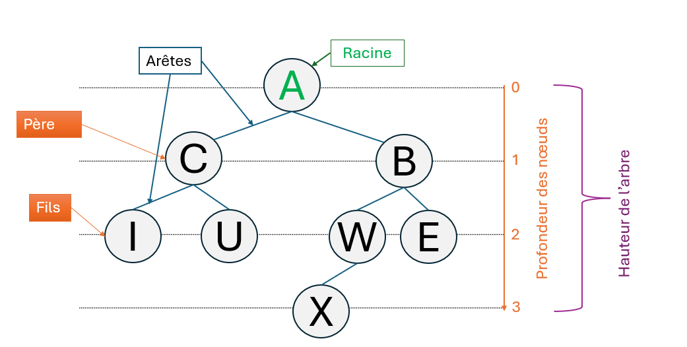
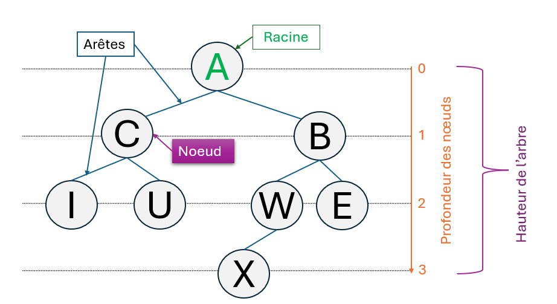
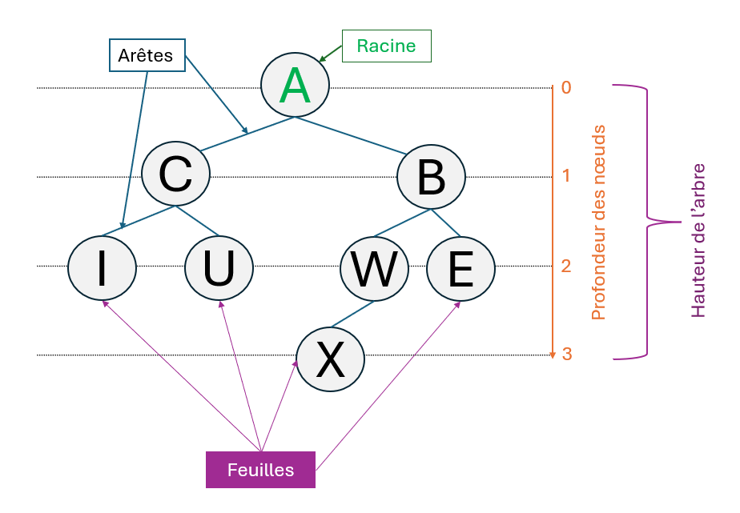
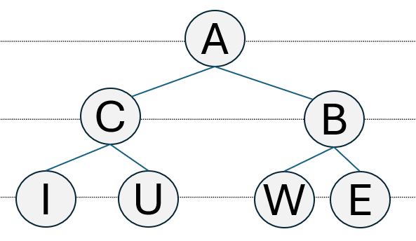
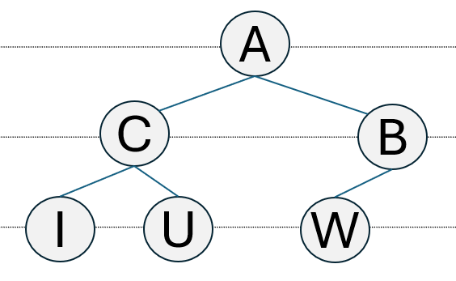
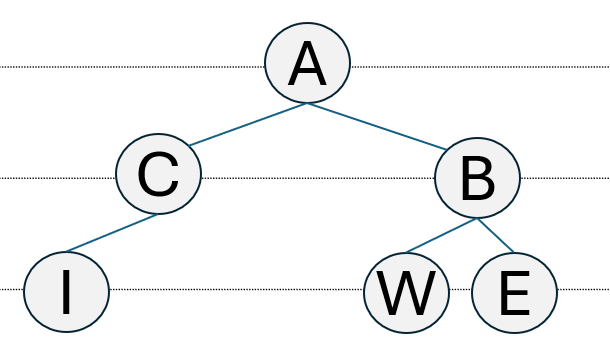
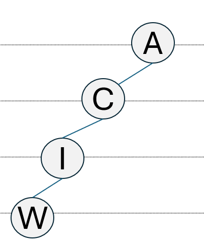

https://www.maxicours.com/se/cours/utiliser-python-pour-determiner-les-mesures-des-arbres-binaires/
https://pixees.fr/informatiquelycee/n_site/nsi_term_structDo_arbre.html
https://tnsi.flallemand.fr/04-arbres/arbres_cours.html

# Les Arbres

## Objectifs
- utiliser python pour déterminer la taille d'un arbre
- utiliser python pour déterminer la hauteur d'un arbre


### [!NOTE] Rappel
- La recursivité (récurrence en Mathématique)
```
On appelle récursive toute fonction ou procédure qui s’appelle elle
même.
```
 Example

```
Algorithme Factorielle
Entrée : un entier positif N
Sortie : factorielle de N

factorielle(N)
    si N = 0 
        retourner 1
    sinon 
        retourner N x factorielle(N-1)

```


### Points Clés
#### Généralité
- Un arbre est un type abstrait utilsé en informatique. 
    - arbre généalogique
    - arbre binaire
    - arbre de tournoi de foot
    - organisation des fichiers et dossiers dans un système de fichiers de type UNIX 
- Un arbre est constitué de **nœuds**, reliés entre eux par des **arêtes** selon une relations **pères-fils**.


On distingue trois types de nœuds :
- La racine de l’arbre est l’unique nœud ne possédant pas de parent.
- les feuilles (ou nœuds externes), éléments ne possédant pas de fils dans l’arbre ;
- les nœuds internes, éléments possédant des fils (sous-branches).



La **profondeur** d’un nœud est la distance (nombre d’arêtes) de la racine au nœud.

La **hauteur** d’un arbre est la plus grande profondeur d’une feuille de l’arbre.

La **taille** d’un arbre est son nombre de nœuds, la longueur de cheminement est la somme des profondeurs de chacune des feuilles.

L’**arité** d’un nœud est son nombre de fils.

L’**étiquette** représente directement la valeur du nœud ou bien une clé associée à une donnée.

Un arbre dont tous les nœuds sont nommés est dit **étiqueté**.
- La taille d'un arbre binaire est son nombre de noeuds.
- La hauteur/ profondeur d'un arbre binnaire est le nombre de niveaux qu'il contient.

Cette structure de donnée est récursive : chaque nœud est lui même nœud-racine d’un sous-arbre (également appelé branche)



#### Arbre binaire
- Un **arbre binaire** est un arbre dont les **nœuds** ont au plus deux fils. On parle alors de **fils gauche** et de **fils droit**. Dans le cas où un nœud a un seul fils, on parle indifféremment de fils gauche ou de fils droit.
    - Il présente les avantages d'un **tableau ordonné** et d'une **liste chaînée**. 
    - Chaque nœud peut être identifié par une **étiquette**.


- Il est possible d’avoir des arbres binaires de même taille mais de « forme » très différente :

    - **Arbre parfait** : tous ses nœuds possèdent exactement 2 fils (sauf les feuilles qui en ont zéro !)

    - **Arbre (presque) complet**: toutes ses feuilles sont à la même profondeur et les feuilles manquantes sont toutes à droite

    - **Arbre équilibré** : toutes ses feuilles sont à la même profondeur

    - **Arbre filiforme (ou dégénéré)** : tous ses nœuds possèdent un unique fils (on parle aussi de peigne).



## Calcul de la taille d'un arbre binaire

```
Pour la calculer, on peut utiliser la représentation récursive des arbres binaires.

En effet, un arbre binaire a est :
- soit vide : sa taille sera égale à 0.
- soit non vide : dans ce cas, a sera composé de sa racine, de son sous-arbre gauche et de son sous-arbre droit.
Sa taille sera donc :
1 + taille(sous-arbre gauche) + taill0e(sous-arbre droit)
```

## Calcul de la hauteur / profondeur d'un arbre binaire

