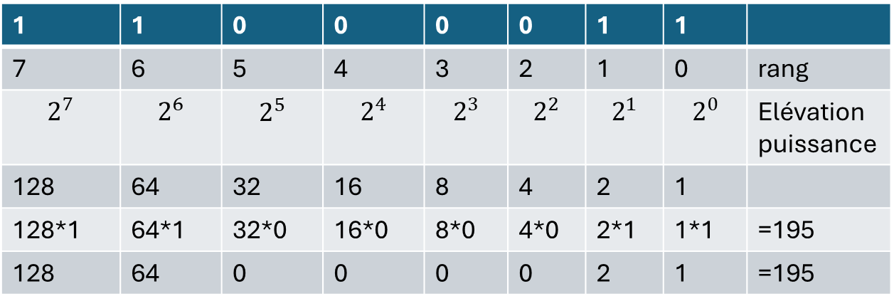

# Representations des données : les entiers naturels

## Objectifs
- répresenter un nombre dans une base n
- utiliser python pour convertir d'une base n à une base m


## Généralité
En représentation décimale, les chiffres sont les signes 0, 1, 2, 3, 4, 5, 6, 7, 8 et 9. D’autres représentations des nombres sont
possibles. La représentation binaire adopte un sous-ensemble des chiffres précédents dans lequel les seuls signes utilisés pour
représenter des entiers sont 0 et 1. La représentation hexadécimale adopte un sur-ensemble des chiffres précédents en ajout les
signes A, B, C, D, E et F. Enfin, d’autres représentations sont encore possibles, avec avec d’autres signes comme par exemple les
chiffres romains, les sinogrammes, etc.
En effet, tout le monde sait compter en base 10 (décimal). Mais comment ça marche ? Comment est construit notre système ? Pour répondre à cette question à l'apparence simple, oubliez tout et reprenons depuis le début : comment avez-vous appris à compter à l'école ?

| Représentation | Signes utilisés                                | Un même entier |
| -------------- | ---------------------------------------------- | -------------- |
| Binaire        | 0, 1                                           | 1111011        |
| Ternaire       | 0, 1, 2                                        | 11120          |
| Octale         | 0, 1, 2, 3, 4, 5, 6, 7                         | 173            |
| Décimale       | 0, 1, 2, 3, 4, 5, 6, 7, 8, 9                   | 123            |
| Hexadécimale   | 0, 1, 2, 3, 4, 5, 6, 7, 8, 9, A, B, C, D, E, F | 7B             |
|                |                                                |                |

## Le système décimal
Un nombre entier est composé de **rangs** (unités, dizaines, centaines, etc). Chaque rang vaut le rang précédent multiplié par l'**indice** de la base. Une centaine vaut dix dizaines, et une dizaine vaut 10 unités. 
Par exemple, dans l'image ci-dessus, on peut voir le nombre $195_{10}$ (ici, le 10 signifie qu'il s'agit d'un nombre, en base 10). Dans ce nombre, on peut voir trois rangs : centaines, dizaines et unités. Pour n'importe quelle base, la valeur d'un rang est égale à `bn`, où `b` est l'indice de la base (ici, 10) et `n` la position du rang. Ici, les unités ont la position 0, les dizaines la position 1 et les centaines la position 2. Nous pouvons donc décomposer 195 en puissance de 10 (unités, dizaines, centaines, etc) :

```math
195=1∗10^2+9∗10^1+5∗10^0
```

> Un nombre est égal à la somme des valeurs de ses rangs, et on peut décomposer n'importe quel nombre en puissance de sa base.

## Le binaire
Le **binaire**, c'est le système de comptage des ordinateurs. Pourquoi le binaire et pas le décimal comme les humains ? Et bien c'est très simple : un ordinateur est composé de circuits électroniques, et donc de composants électriques. Le plus simple pour compter est donc d'utiliser un système en base 2 (le binaire) car on peut représenter ses deux valeurs possibles (0 et 1) par un signal électrique : 1, y'a du courant, 0, y'en a pas (c'est la version simple).

En binaire, c'est pareil à la différence qu'on utilise le terme **bit**, qui est la contraction de "binary digit", littéralement "chiffre binaire". Par exemple, le nombre 10011 occupe 5 bits. Là où tout se complique, c'est que comme je l'ai expliqué, chaque rang en binaire ne peut avoir que deux valeurs (binaire = base 2) différentes : 0 ou 1. Pour la base 10, chaque rang représente une puissance de 10, pour la base 2, chaque rang occupe une puissance de 2. Voici comment compter en binaire jusqu'à 10 :

| Nombre en décimal | Nombre en binaire | Le pourquoi du comment                                                          |
| ----------------- | ----------------- | ------------------------------------------------------------------------------- |
| 0                 | 0                 | Pour l'instant, ça va.                                                          |
| 1                 | 1                 | Là encore, c'est simple.                                                        |
| 2                 | 10                | Le premier rang ayant été rempli, on passe au suivant !                         |
| 3                 | 11                | On re-remplit le rang 1.                                                        |
| 4                 | 100               | Le rang 2 est plein, le rang 1 aussi, qu'à cela ne tienne, on passe au suivant. |
| 5                 | 101               | On continue en suivant la même méthode.                                         |
| 6                 | 110               | On continue en suivant la même méthode.                                         |
| 7                 | 111               | On continue en suivant la même méthode.                                         |
| 8                 | 1000              | On commence le rang 4.                                                          |
| 9                 | 1001              | On continue comme tout à l'heure.                                               |
| 10                | 1010              | On continue comme tout à l'heure.                                               |
| ...               | ...               | ...                                                                               |

> - avec 1 bit on peut coder 2 valeurs (0 et 1)
> - avec 2 bits on peut coder 4 valeurs (00, 01, 10 et 11)
> - avec 3 bits on peut coder 8 valeurs (000, 001, 010, 011, 100, 101, 110, 111)
> - avec n bits on peut coder... 2n valeurs (vérifications : 21 = 2 ; 22 = 4 ; 23 = 8 ...)

Comment écrire 195 en binaire?

## L'hexadécimal
## La conversion
### Conversion décimale binaire
Il existe bien sûr plusieurs méthodes de conversion, mais nous allons étudier la plus simple et la plus rapide. Il s'agit de la **méthode euclidienne**.

#### Méthode :
> On prend le nombre en base 10 (forme normale). On le divise par 2 et on note le reste de la division (soit 1 soit 0) On refait la même chose avec le quotient précédent, et on met de nouveau le reste de côté. On réitère la division, jusqu'à ce que le quotient soit 0. Le nombre en binaire apparaît alors : **il suffit de prendre tous les restes de bas en haut**. 

Exemple :

    195 = 2 * 97 + 1
    97 = 2 * 48 + 1
    48 = 2 * 24 + 0
    24 = 2 * 12 + 0
    12 = 2 * 6 + 0
    6 = 2 * 3 + 0
    3 = 2 * 1 + 1
    1 = 2 * 0 + 1

__Attention, il faut bien lire de bas en haut !__

> 195 en base 10 vaut donc 11000011 en binaire.
> 
> $195_{10}$ = $11000011_{2}$


A Faire: Ecrire un programme en python qui implémente la méthode eucludienne.


### Conversion binaire décimale

Prenons un nombre au hasard, tel que 11010011. Il s'étale sur 8 rangs, et comme dit précédemment, chaque rang correspond à une puissance de deux. Le premier rang (en partant de la droite) est le rang 0, le second est le 1, etc.

Pour convertir le tout en décimale, on procède de la manière suivante : on multiplie par $2^0$ la valeur du rang 0, par $2^1$ la valeur du rang 1, par $2^2$ la valeur du rang 2, [...], par $2^{10}$ la valeur du rang 10, etc.

Après ça, il ne reste plus qu'à remplacer les puissances de 2 par leurs valeurs et de calculer la somme : (**Attention à bien partir de la droite !**) 




$11010011_{binaire}$=1∗1+1∗2+0∗4+0∗8+0∗16+0∗32+1∗64+1∗128 = $195_{décimal}$

A Faire: Ecrire un programme en python qui implémente la conversion binaire décimale.


### Conversion d'un nombre binaire en hexadécimal (et vice versa)
### Conversion d'un nombre décimal en hexadécimal
### Conversion d'un nombre hexadécimal en décimal


